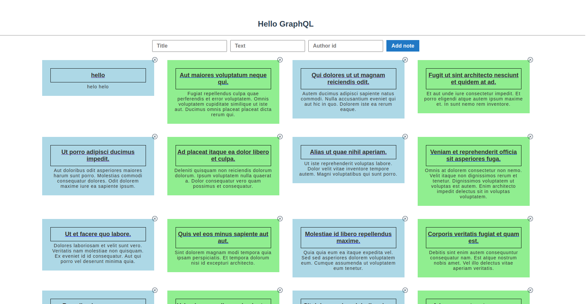

# Simple GraphQL Laravel Vue implementation

This project is all about the implementation of GraphQL, in Laravel and VueJs. Basically here i implement simple CRUD(Create, Read, Update, Delete) operations with GraphQL API. GraphQL is a query language for API and a server-side runtime for execution queries using a type system for defining data. This service is created by defining types and fields on those types, then providing functions for each field on each type.

#### Technology: 
* Laravel
* VueJS
* PostgresSQL / SQLite

## Installation
* #### Clone git repository:
```
git clone https://github.com/sudiptoshahin/laravel-graphql-vue.git
```
* #### Go to project directory:
```cd laravel-graphql-vue```
* #### Database setup
  * ##### For PostgreSQL
    ```cd backend``` and create a file named ```.env``` Copy everything from ```/.env-example``` to ```/.env``` file and uncomment from DB_CONNECTION to DB_PASSWORD. and create a database in postgres by using PGAdmin or use those following commands:
 ```
# Access PostgreSQL
psql -U your_username -d laravel_graphql_vue -h your_host -W

# Create a database
CREATE DATABASE laravel_graphql_vue;

# Switch to the new database
\c laravel_graphql_vue

# Verify the creation of the database
\l

# Exit PostgreSQL
\q
 ```
  * ##### For SQLite
For SQLite database you just need to uncomment the following line
```
# DB_CONNECTION=sqlite
# DB_DATABASE=database.sqlite
```

Then ```cd backend``` and Use the following command for install the laravel dependancy packages:

```
# Clear composer cache
composer clear-cache

# Installing packages
composer install

# Generate optimized autoloader
composer dump-autoload
```
Our packages are installed and now we run database migration and seed command for the dummy data.
##### NB: Please run those commands inside of /backend directory
```
# run migration and seeder
php artisan migrate:fresh --seed

# then run the local server
php artisan serve
```
#### For run the graphql query for testing purpose
```
http://127.0.0.1:8000/graphiql
```

### Now we setup the frontend:
```cd frontend``` and run those commands
```

# install packages
npm install -f

# run frontend
npm run serve
```

#### ui



## License

[MIT](https://choosealicense.com/licenses/mit/)